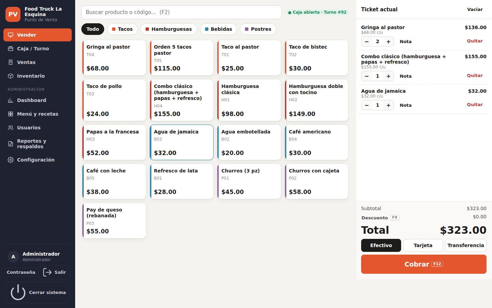
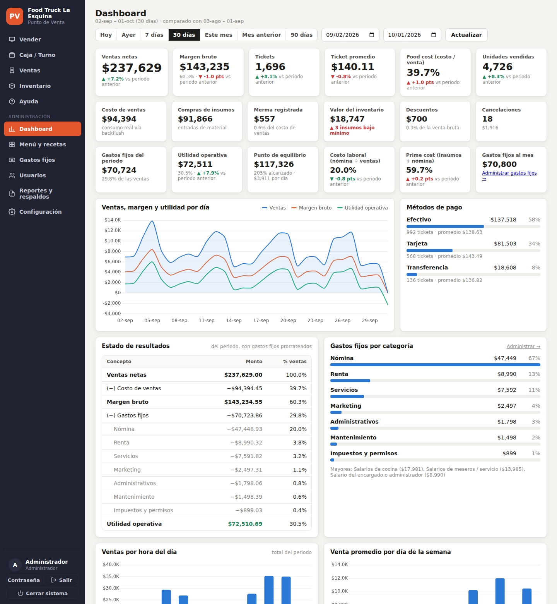
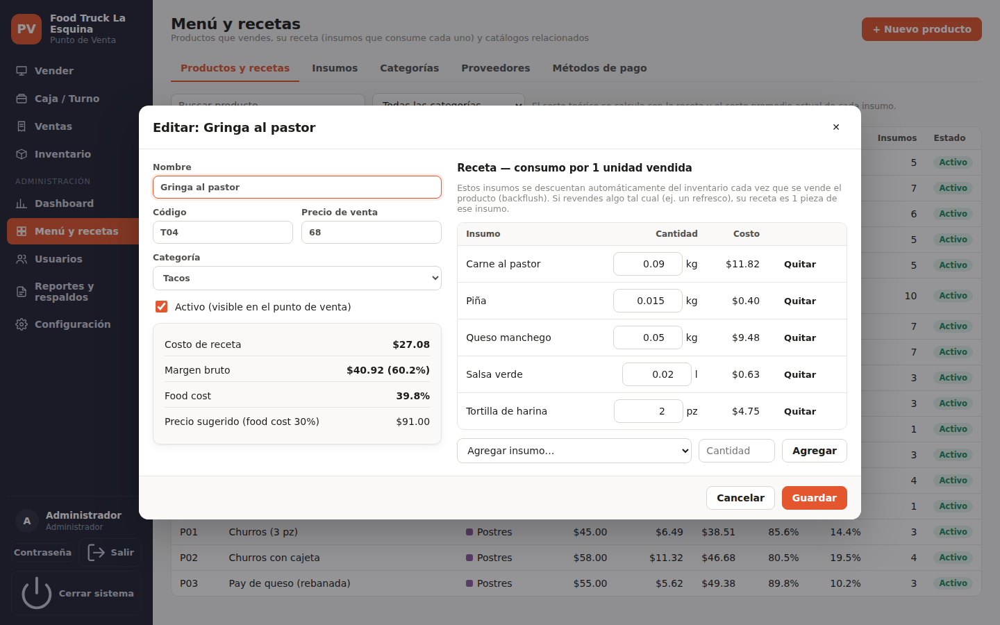
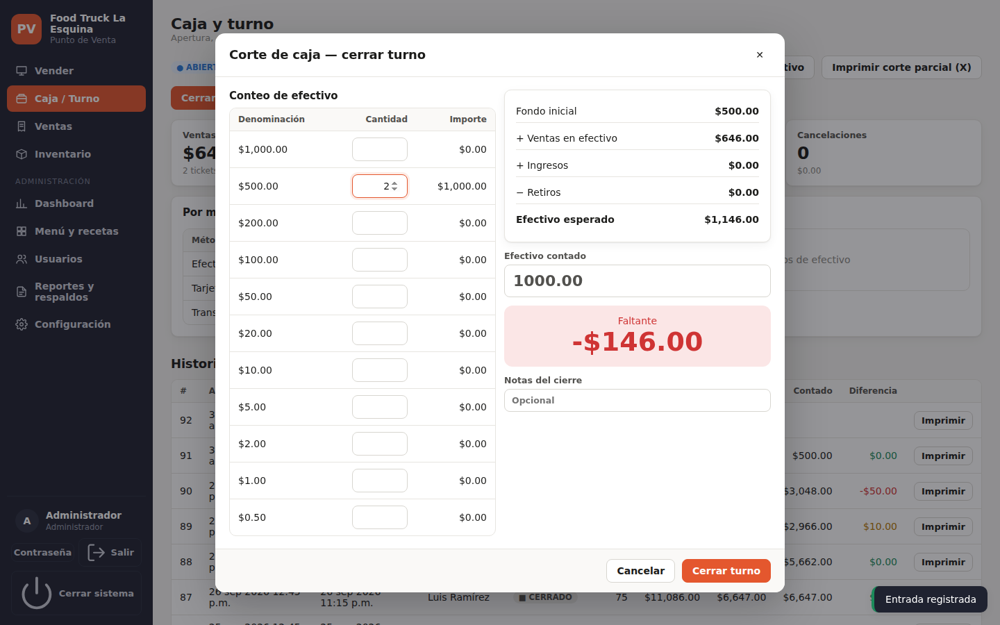
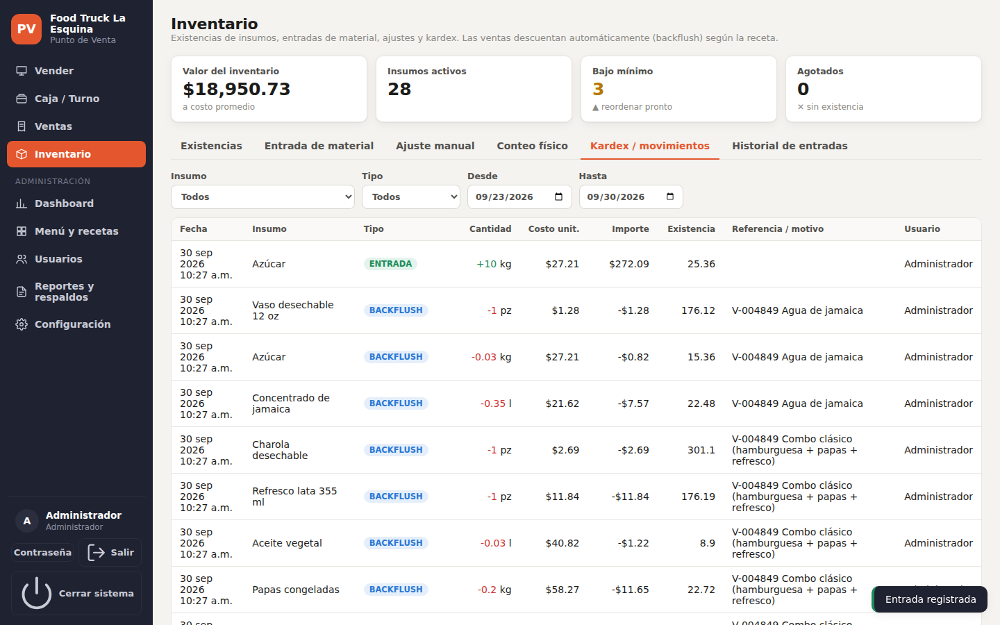

# Punto de Venta MASTER

[](https://github.com/JuanDiaz-DataAnalyst/punto-de-venta-master/actions/workflows/ci.yml)
[](https://github.com/JuanDiaz-DataAnalyst/punto-de-venta-master/actions/workflows/build-windows.yml)


Punto de venta de escritorio para **micro y pequeños negocios de comida** (restaurantes, food trucks,
dark kitchens, cafeterías). Controla ventas, costos e inventario con **backflush automático por receta**,
maneja caja y usuarios por nivel, y trae un **dashboard** para la administración. Funciona **sin internet**
y está construido con software gratuito.



## Funcionalidades

- **Venta rápida**: categorías, búsqueda por código, notas por platillo, descuentos, efectivo con cambio,
  tarjeta y transferencia, ticket térmico 58/80 mm. Atajos F2 / F9 / F12.
- **Backflush automático**: cada venta descuenta los insumos de su receta al costo promedio y guarda el
  costo real (COGS) y el margen por renglón. Cancelar revierte exactamente el consumo.
- **Inventario**: entradas de material con costo promedio ponderado, ajustes manuales con motivo, conteo
  físico masivo, alertas de mínimo y kardex completo.
- **Caja**: turnos, fondo inicial, ingresos/retiros y corte con conteo por denominación.
- **Usuarios** Admin / User con contraseñas cifradas y bitácora de auditoría.
- **Dashboard**: KPIs vs. periodo anterior, tendencia, ventas por hora y día, top productos, categorías,
  métodos de pago, **ingeniería de menú**, rentabilidad por producto, cobertura de inventario, merma y
  desempeño por usuario.
- **Reportes**: exportación a Excel/CSV, respaldos automáticos y restauración.

| Dashboard | Receta con costo y margen |
|---|---|
|  |  |
| **Corte de caja** | **Kardex** |
|  |  |

## Instalación (usuario final)

Descarga el instalador o la versión portable desde **[Releases](https://github.com/JuanDiaz-DataAnalyst/punto-de-venta-master/releases)**.
Requiere Windows 10/11 con *Microsoft Edge WebView2 Runtime* (incluido en Windows actualizado).
Consulta el [manual de usuario](docs/manual-de-usuario.md) o abre el **[manual interactivo paso a paso](docs/manual-interactivo.html)** (un solo archivo; funciona en computadora, teléfono y tablet).

## Desarrollo

```bat
git clone https://github.com/JuanDiaz-DataAnalyst/punto-de-venta-master.git
cd punto-de-venta-master
py -3.12 -m venv .venv
.venv\Scripts\activate
python -m pip install -r requirements-dev.txt

python -m pytest                      &:: pruebas
ruff check . && ruff format --check . &:: estilo
python -m app.main --browser --demo   &:: app con datos de ejemplo (BD vacía)
scripts\build.bat                     &:: lint + pruebas + .exe + instalador
```

La API documentada queda en `http://127.0.0.1:8765/api/docs` al correr `python -m app.main --server`.
Guía de trabajo en [CONTRIBUTING.md](CONTRIBUTING.md) y contexto para Claude Code en [CLAUDE.md](CLAUDE.md).

## Arquitectura

| Capa | Tecnología |
|---|---|
| Base de datos | SQLite (esquema estrella: `fact_ventas`, `fact_movimientos_inventario` + dimensiones) |
| Backend | Python · FastAPI · Uvicorn |
| Frontend | HTML · CSS · JavaScript (módulos ES, sin build) · Chart.js |
| Escritorio | pywebview (WebView2) |
| Distribución | PyInstaller · Inno Setup · GitHub Actions |

Detalles en [docs/arquitectura.md](docs/arquitectura.md) y [docs/modelo-de-datos.md](docs/modelo-de-datos.md).

```
app/
  main.py · server.py · config.py      arranque, API, configuración
  services.py                          reglas de negocio (ventas, backflush, inventario, caja)
  db.py                                esquema SQLite, vistas analíticas, respaldos
  security.py · ticket.py · seed.py    autenticación, ticket térmico, datos de ejemplo
  routers/                             endpoints por módulo
  static/                              frontend (index.html, css, js/views, vendor)
tests/                                 pruebas por módulo, BD aislada por prueba
packaging/                             PyInstaller (.spec), Inno Setup (.iss), ícono
scripts/                               build.bat, dev.bat
docs/                                  arquitectura, modelo de datos, manual, capturas
.github/                               CI, build de Windows, plantillas, Dependabot
```

## Hoja de ruta
- [ ] Modificadores con precio (extra queso +$10) que también descuenten inventario
- [ ] Comandas a cocina (pantalla KDS o impresora de cocina)
- [ ] Varias terminales en red (PostgreSQL)
- [ ] Facturación CFDI 4.0 vía PAC

## Licencia
© 2026 Juan Díaz Vega. Todos los derechos reservados — ver [LICENSE](LICENSE).
Componentes de terceros en [THIRD_PARTY_NOTICES.md](THIRD_PARTY_NOTICES.md).
