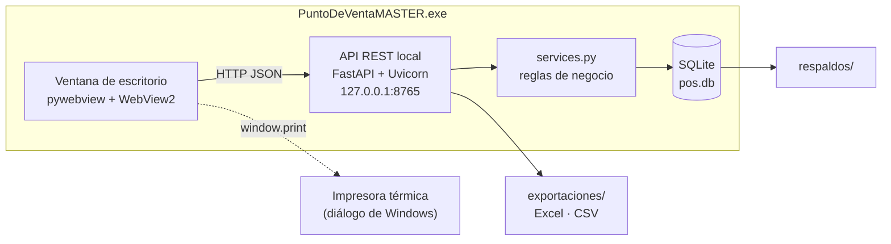
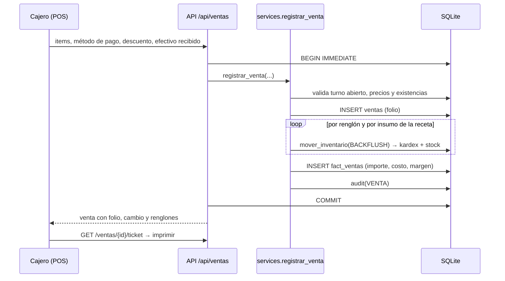

# Arquitectura

## Vista general

- **Un solo proceso**: `app/main.py` inicia Uvicorn en un hilo y abre la ventana con pywebview en el hilo principal.
  Si WebView2 no está disponible, abre el navegador predeterminado y el sistema se cierra desde el menú.
- **Datos fuera de la carpeta de instalación**: `%LOCALAPPDATA%\PuntoDeVentaMASTER` (`pos.db`, `respaldos\`,
  `exportaciones\`, `logs\`). Se puede cambiar con `POS_DATA_DIR`.
- **Offline**: no hay dependencias de red; Chart.js está vendorizado.

## Capas del backend

| Capa | Archivos | Responsabilidad |
|---|---|---|
| Arranque | `main.py`, `config.py` | Rutas, puerto, logging, respaldo al iniciar, ventana |
| HTTP | `server.py`, `routers/*.py` | Validación (Pydantic), autorización, serialización |
| Dominio | `services.py` | Ventas, backflush, costo promedio, ajustes, turnos |
| Datos | `db.py` | Esquema, vistas, auditoría, respaldos |
| Seguridad | `security.py` | PBKDF2-SHA256 (200 000 iteraciones) y sesiones por token |

Los routers no contienen reglas de negocio; llaman a `services`, que recibe una conexión y trabaja dentro de
la transacción del llamador. Los errores de negocio se lanzan como `ErrorNegocio` y se convierten en JSON
`{detail, datos}` con el código HTTP adecuado.

## Flujo de una venta

## Cuentas abiertas por mesa

Una mesa es una fila de `cuentas` con sus renglones en `cuenta_items`. El folio se toma de un consecutivo
compartido (`services.siguiente_folio`) al abrir la cuenta; al cobrar, `services.cobrar_cuenta` llama a
`registrar_venta` con ese mismo folio y la mesa, de modo que el flujo anterior (backflush, costo, margen)
ocurre en ese momento. El estado de las pestañas vive en el servidor: el frontend solo recuerda cuál está activa.

## Gastos fijos

`gastos_fijos` guarda monto mensual y vigencia. `services.prorratear_gastos` los reparte por día
(monto ÷ días del mes) y el dashboard los resta al margen bruto: utilidad = margen − gastos del periodo,
punto de equilibrio = gastos ÷ margen %.

## Frontend

- SPA sin framework ni build: `index.html` carga `js/app.js` (módulo ES) que enruta por hash (`#/pos`,
  `#/dashboard`…) e importa dinámicamente `js/views/<pantalla>.js`.
- Cada vista exporta `render(contenedor, ctx)` y opcionalmente regresa una función de limpieza.
- `js/api.js` agrega el token de sesión y normaliza errores; `js/ui.js` concentra formato, modales, tablas e impresión.
- El menú se construye según el rol; el backend vuelve a validar cada permiso.

## Seguridad

- Contraseñas con PBKDF2-SHA256 y sal aleatoria; nunca se guardan en claro.
- Sesiones con token aleatorio en memoria, expiran tras 14 h de inactividad.
- El servidor escucha solo en `127.0.0.1` (no es accesible desde la red).
- Toda acción sensible (ventas, cancelaciones, ajustes, cambios de precio, usuarios, respaldos) queda en `log_auditoria`.

## Decisiones (ADR resumido)

| Decisión | Alternativas | Motivo |
|---|---|---|
| SQLite | PostgreSQL, MySQL | Sin instalación ni servidor; respaldo = copiar un archivo; suficiente para 1 terminal |
| FastAPI + HTML | Electron, .NET | Aprovecha Python/SQL; UI moderna sin empaquetar un navegador (~40 MB vs ~150 MB) |
| Sin ORM | SQLAlchemy | Consultas analíticas explícitas y legibles; menos dependencias |
| Backflush en tiempo real | Consumo teórico al cierre | Kardex y costo de venta exactos por ticket |
| Costo promedio ponderado | PEPS/UEPS | Estándar simple para micro negocio; aceptado fiscalmente en México |
