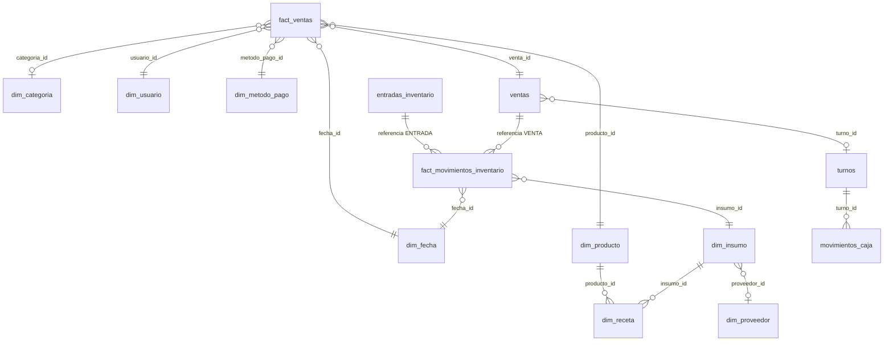

# Modelo de datos

Base de datos **SQLite** en `%LOCALAPPDATA%\PuntoDeVentaMASTER\pos.db`, modelada como **esquema estrella**:
dos tablas de hechos rodeadas de dimensiones, más tablas transaccionales de soporte. El esquema completo
está en [`app/db.py`](../app/db.py).

## Vistas analíticas

Listas para Power BI (conector ODBC de SQLite) o para consultas directas:

| Vista | Contenido |
|---|---|
| `v_ventas_detalle` | `fact_ventas` desnormalizada con fecha, producto, categoría, usuario y método de pago (solo ventas pagadas). |
| `v_inventario_valorizado` | Existencia × costo promedio y estado (`OK`, `BAJO`, `AGOTADO`). |
| `v_costo_receta` | Costo teórico y margen teórico por producto según su receta. |
| `v_movimientos_inventario` | Kardex con nombres de insumo y usuario. |

## Invariantes

- `dim_insumo.stock_actual = SUM(fact_movimientos_inventario.cantidad)` por insumo.
- `ventas.total = SUM(fact_ventas.importe_neto)` por venta (el descuento se prorratea).
- `fact_ventas.margen = importe_neto − costo_total`.
- Tipos de movimiento: `INICIAL`, `ENTRADA`, `BACKFLUSH` (venta), `AJUSTE`, `CANCELACION`.

## Diccionario de datos

### `fact_ventas`

**Tabla de hechos principal.** Grano: un renglón de producto vendido. Medidas aditivas: cantidad, importes, costo y margen.

| Columna | Tipo | Nulo | Llave |
|---|---|---|---|
| `linea_id` | INTEGER | no | PK |
| `venta_id` | INTEGER | no | FK → `ventas.venta_id` |
| `fecha_id` | INTEGER | no | FK → `dim_fecha.fecha_id` |
| `fecha_hora` | TEXT | no |  |
| `hora` | INTEGER | no |  |
| `producto_id` | INTEGER | no | FK → `dim_producto.producto_id` |
| `categoria_id` | INTEGER | sí | FK → `dim_categoria.categoria_id` |
| `usuario_id` | INTEGER | no | FK → `dim_usuario.usuario_id` |
| `metodo_pago_id` | INTEGER | no | FK → `dim_metodo_pago.metodo_pago_id` |
| `turno_id` | INTEGER | sí | FK → `turnos.turno_id` |
| `cantidad` | REAL | no |  |
| `precio_unitario` | REAL | no |  |
| `importe_bruto` | REAL | no |  |
| `descuento` | REAL | no |  |
| `importe_neto` | REAL | no |  |
| `costo_unitario` | REAL | no |  |
| `costo_total` | REAL | no |  |
| `margen` | REAL | no |  |
| `nota` | TEXT | sí |  |

### `fact_movimientos_inventario`

**Hechos de inventario (kardex).** Un movimiento por insumo; `cantidad` con signo (+ entra, − sale).

| Columna | Tipo | Nulo | Llave |
|---|---|---|---|
| `movimiento_id` | INTEGER | no | PK |
| `fecha_hora` | TEXT | no |  |
| `fecha_id` | INTEGER | no | FK → `dim_fecha.fecha_id` |
| `insumo_id` | INTEGER | no | FK → `dim_insumo.insumo_id` |
| `tipo` | TEXT | no |  |
| `cantidad` | REAL | no |  |
| `costo_unitario` | REAL | no |  |
| `costo_total` | REAL | no |  |
| `stock_resultante` | REAL | no |  |
| `referencia_tipo` | TEXT | sí |  |
| `referencia_id` | INTEGER | sí |  |
| `motivo` | TEXT | sí |  |
| `usuario_id` | INTEGER | sí | FK → `dim_usuario.usuario_id` |

### `dim_fecha`

Calendario precargado (2 años atrás a 5 adelante). Llave `AAAAMMDD`.

| Columna | Tipo | Nulo | Llave |
|---|---|---|---|
| `fecha_id` | INTEGER | no | PK |
| `fecha` | TEXT | no |  |
| `anio` | INTEGER | no |  |
| `trimestre` | INTEGER | no |  |
| `mes` | INTEGER | no |  |
| `nombre_mes` | TEXT | no |  |
| `semana_iso` | INTEGER | no |  |
| `dia` | INTEGER | no |  |
| `dia_semana` | INTEGER | no |  |
| `nombre_dia` | TEXT | no |  |
| `es_fin_semana` | INTEGER | no |  |

### `dim_usuario`

Usuarios del sistema y su nivel (`ADMIN` / `USER`).

| Columna | Tipo | Nulo | Llave |
|---|---|---|---|
| `usuario_id` | INTEGER | no | PK |
| `username` | TEXT | no |  |
| `nombre` | TEXT | no |  |
| `rol` | TEXT | no |  |
| `password_hash` | TEXT | no |  |
| `salt` | TEXT | no |  |
| `activo` | INTEGER | no |  |
| `creado_en` | TEXT | no |  |
| `ultimo_acceso` | TEXT | sí |  |

### `dim_categoria`

Categorías del menú (color usado en el POS).

| Columna | Tipo | Nulo | Llave |
|---|---|---|---|
| `categoria_id` | INTEGER | no | PK |
| `nombre` | TEXT | no |  |
| `color` | TEXT | no |  |
| `orden` | INTEGER | no |  |
| `activo` | INTEGER | no |  |

### `dim_producto`

Productos que se venden (menú).

| Columna | Tipo | Nulo | Llave |
|---|---|---|---|
| `producto_id` | INTEGER | no | PK |
| `codigo` | TEXT | sí |  |
| `nombre` | TEXT | no |  |
| `categoria_id` | INTEGER | sí | FK → `dim_categoria.categoria_id` |
| `precio_venta` | REAL | no |  |
| `activo` | INTEGER | no |  |
| `creado_en` | TEXT | no |  |
| `actualizado_en` | TEXT | sí |  |

### `dim_insumo`

Materias primas / insumos con existencia y costo promedio ponderado.

| Columna | Tipo | Nulo | Llave |
|---|---|---|---|
| `insumo_id` | INTEGER | no | PK |
| `codigo` | TEXT | sí |  |
| `nombre` | TEXT | no |  |
| `unidad` | TEXT | no |  |
| `costo_promedio` | REAL | no |  |
| `stock_actual` | REAL | no |  |
| `stock_minimo` | REAL | no |  |
| `proveedor_id` | INTEGER | sí | FK → `dim_proveedor.proveedor_id` |
| `activo` | INTEGER | no |  |
| `creado_en` | TEXT | no |  |
| `actualizado_en` | TEXT | sí |  |

### `dim_receta`

Lista de materiales: cantidad de cada insumo consumida por 1 unidad de producto.

| Columna | Tipo | Nulo | Llave |
|---|---|---|---|
| `producto_id` | INTEGER | no | PK |
| `insumo_id` | INTEGER | no | PK |
| `cantidad` | REAL | no |  |

### `dim_proveedor`

Proveedores de insumos.

| Columna | Tipo | Nulo | Llave |
|---|---|---|---|
| `proveedor_id` | INTEGER | no | PK |
| `nombre` | TEXT | no |  |
| `contacto` | TEXT | sí |  |
| `telefono` | TEXT | sí |  |
| `email` | TEXT | sí |  |
| `activo` | INTEGER | no |  |

### `dim_metodo_pago`

Métodos de pago; `es_efectivo` define si suma al corte de caja.

| Columna | Tipo | Nulo | Llave |
|---|---|---|---|
| `metodo_pago_id` | INTEGER | no | PK |
| `nombre` | TEXT | no |  |
| `es_efectivo` | INTEGER | no |  |
| `activo` | INTEGER | no |  |

### `ventas`

Encabezado del ticket (dimensión degenerada `folio`), estado y cancelación.

| Columna | Tipo | Nulo | Llave |
|---|---|---|---|
| `venta_id` | INTEGER | no | PK |
| `folio` | TEXT | no |  |
| `fecha_hora` | TEXT | no |  |
| `fecha_id` | INTEGER | no | FK → `dim_fecha.fecha_id` |
| `usuario_id` | INTEGER | no | FK → `dim_usuario.usuario_id` |
| `turno_id` | INTEGER | sí | FK → `turnos.turno_id` |
| `metodo_pago_id` | INTEGER | no | FK → `dim_metodo_pago.metodo_pago_id` |
| `subtotal` | REAL | no |  |
| `descuento` | REAL | no |  |
| `total` | REAL | no |  |
| `pago_recibido` | REAL | sí |  |
| `cambio` | REAL | sí |  |
| `costo_total` | REAL | no |  |
| `estado` | TEXT | no |  |
| `cancelada_en` | TEXT | sí |  |
| `cancelada_por` | INTEGER | sí | FK → `dim_usuario.usuario_id` |
| `motivo_cancelacion` | TEXT | sí |  |
| `cliente` | TEXT | sí |  |
| `notas` | TEXT | sí |  |

### `turnos`

Turnos de caja: apertura, fondo, efectivo esperado/contado y diferencia.

| Columna | Tipo | Nulo | Llave |
|---|---|---|---|
| `turno_id` | INTEGER | no | PK |
| `usuario_apertura_id` | INTEGER | no | FK → `dim_usuario.usuario_id` |
| `usuario_cierre_id` | INTEGER | sí | FK → `dim_usuario.usuario_id` |
| `apertura` | TEXT | no |  |
| `cierre` | TEXT | sí |  |
| `fondo_inicial` | REAL | no |  |
| `efectivo_esperado` | REAL | sí |  |
| `efectivo_contado` | REAL | sí |  |
| `diferencia` | REAL | sí |  |
| `notas` | TEXT | sí |  |
| `estado` | TEXT | no |  |

### `movimientos_caja`

Ingresos y retiros de efectivo durante un turno.

| Columna | Tipo | Nulo | Llave |
|---|---|---|---|
| `mov_caja_id` | INTEGER | no | PK |
| `turno_id` | INTEGER | no | FK → `turnos.turno_id` |
| `fecha_hora` | TEXT | no |  |
| `tipo` | TEXT | no |  |
| `monto` | REAL | no |  |
| `concepto` | TEXT | no |  |
| `usuario_id` | INTEGER | no | FK → `dim_usuario.usuario_id` |

### `entradas_inventario`

Encabezado de cada entrada de material (factura, proveedor, total).

| Columna | Tipo | Nulo | Llave |
|---|---|---|---|
| `entrada_id` | INTEGER | no | PK |
| `fecha_hora` | TEXT | no |  |
| `proveedor_id` | INTEGER | sí | FK → `dim_proveedor.proveedor_id` |
| `factura` | TEXT | sí |  |
| `notas` | TEXT | sí |  |
| `usuario_id` | INTEGER | no | FK → `dim_usuario.usuario_id` |
| `total` | REAL | no |  |

### `log_auditoria`

Bitácora de acciones de los usuarios.

| Columna | Tipo | Nulo | Llave |
|---|---|---|---|
| `log_id` | INTEGER | no | PK |
| `fecha_hora` | TEXT | no |  |
| `usuario_id` | INTEGER | sí | FK → `dim_usuario.usuario_id` |
| `accion` | TEXT | no |  |
| `entidad` | TEXT | sí |  |
| `entidad_id` | INTEGER | sí |  |
| `detalle` | TEXT | sí |  |

### `config`

Parámetros clave/valor del negocio y del sistema.

| Columna | Tipo | Nulo | Llave |
|---|---|---|---|
| `clave` | TEXT | no | PK |
| `valor` | TEXT | sí |  |

